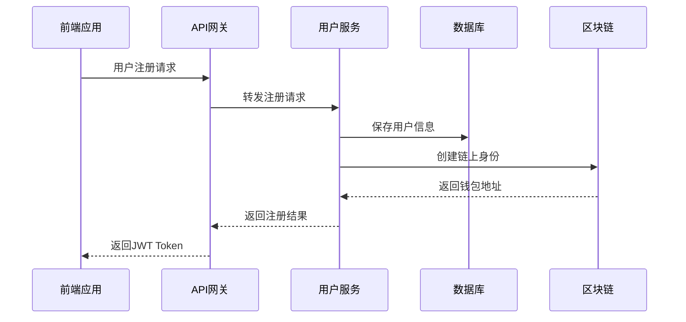
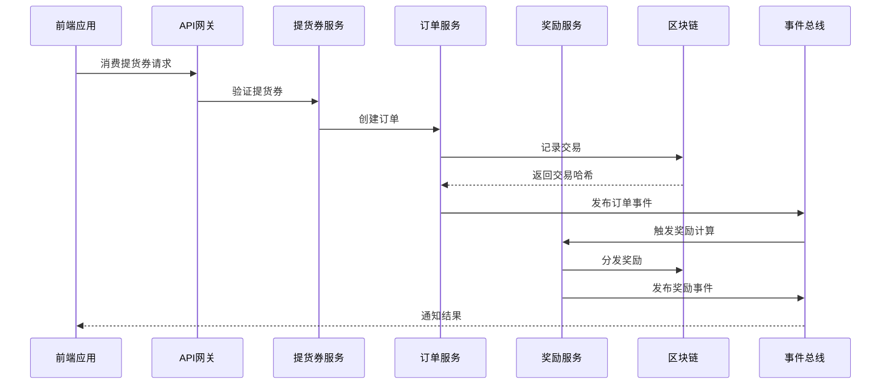
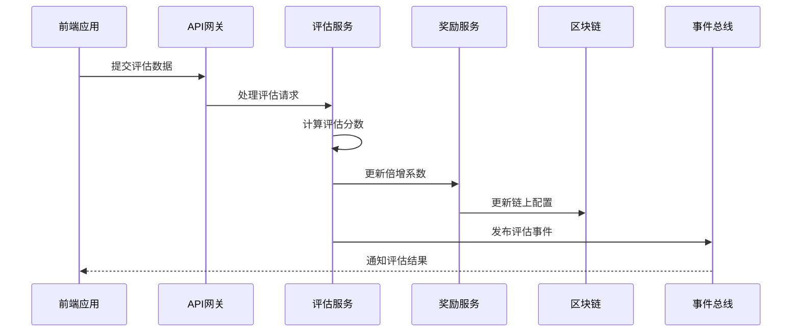

# SoonShop 整体技术架构优化方案

## 📋 架构概述

SoonShop是一个基于共产主义经济原理的现代化区块链商业平台，采用微服务架构，实现前后端分离、事件驱动和分布式部署。

## 🏗️ 整体架构设计

### 架构分层

```
┌─────────────────────────────────────────────────────────────┐
│                    前端应用层                                │
│     React 18 + TypeScript + Vite + Solana Web3.js          │
└─────────────────────────────────────────────────────────────┘
                              │
┌─────────────────────────────────────────────────────────────┐
│                    API网关层                                │
│      路由转发 + 认证授权 + 限流熔断 + 监控日志              │
└─────────────────────────────────────────────────────────────┘
                              │
┌─────────────────────────────────────────────────────────────┐
│                 后端微服务层                                │
│  用户服务 + 产品服务 + 订单服务 + 支付服务 + 奖励服务       │
└─────────────────────────────────────────────────────────────┘
                              │
┌─────────────────────────────────────────────────────────────┐
│                 事件驱动层                                  │
│     事件总线 + 消息队列 + 事件存储 + 状态同步               │
└─────────────────────────────────────────────────────────────┘
                              │
┌─────────────────────────────────────────────────────────────┐
│                 区块链层                                    │
│    智能合约 + Solana RPC + 客户端SDK + 交易处理              │
└─────────────────────────────────────────────────────────────┘
                              │
┌─────────────────────────────────────────────────────────────┐
│                 数据存储层                                  │
│  PostgreSQL + Redis + ElasticSearch + IPFS + 区块链存储      │
└─────────────────────────────────────────────────────────────┘
```

## 🔧 各模块功能详解

### 1. 前端应用层 (frontend-react)

**核心功能：**
- 用户界面展示和交互
- 状态管理和数据流控制
- 区块链钱包集成
- 实时数据更新

**技术栈：**
- React 18 + TypeScript
- Zustand (状态管理)
- React Query (服务端状态)
- Ant Design + Tailwind CSS
- Solana Web3.js + Wallet Adapter

**关键特性：**
- 响应式设计，支持移动端
- 组件化开发，代码复用性高
- 集成Solana钱包，支持多种钱包
- 实时数据同步，用户体验流畅

### 2. API网关层 (api-gateway)

**核心功能：**
- 统一API入口和路由转发
- JWT认证和RBAC权限控制
- 请求限流和安全防护
- 服务发现和负载均衡

**技术栈：**
- Rust + Actix-web
- JWT认证 + Redis缓存
- Prometheus监控 + Jaeger追踪
- 限流中间件 + CORS配置

**关键特性：**
- 高性能请求处理，支持高并发
- 完整的认证授权体系
- 实时监控和链路追踪
- 故障隔离和熔断保护

### 3. 后端微服务层

#### 用户服务 (user-service)
- 用户注册、登录、资料管理
- 角色权限管理
- 钱包地址绑定
- 用户行为分析

#### 产品服务 (product-service)
- 商品信息管理
- 库存管理
- 分类管理
- 搜索和筛选

#### 订单服务 (order-service)
- 订单创建和管理
- 订单状态跟踪
- 支付状态同步
- 订单履约管理

#### 支付服务 (payment-service)
- 支付处理和验证
- 多种支付方式支持
- 交易记录管理
- 退款处理

#### 提货券服务 (voucher-service)
- 提货券发行和管理
- 提货券领取和消费
- 库存控制
- 有效期管理

#### 奖励服务 (reward-service)
- 倍增奖励计算
- 奖励分发管理
- 激励规则配置
- 奖励历史记录

#### 评估服务 (evaluation-service)
- 企业评估管理
- 评估指标配置
- 评估结果计算
- 评估报告生成

#### 通知服务 (notification-service)
- 消息推送
- 邮件发送
- 短信通知
- 系统公告

### 4. 事件驱动层

**核心功能：**
- 服务间异步通信
- 事件发布和订阅
- 数据最终一致性
- 系统解耦和扩展

**技术栈：**
- RabbitMQ消息队列
- 事件溯源存储
- 分布式事务处理
- 补偿机制

### 5. 区块链层 (contract-solana)

**核心功能：**
- 智能合约执行
- 链上数据存储
- 交易处理和验证
- 分布式共识

**技术栈：**
- Solana区块链
- Anchor框架
- Rust + TypeScript SDK
- Web3.js客户端

### 6. 数据存储层

**存储策略：**
- PostgreSQL：关系型数据
- Redis：缓存和会话
- ElasticSearch：搜索和分析
- IPFS：分布式文件存储
- 区块链：不可篡改数据

## 🔄 交互流程设计

### 1. 用户注册流程



### 2. 提货券消费流程



### 3. 企业评估流程



## 🛡️ 安全性设计

### 1. 认证授权
- JWT Token认证机制
- 基于角色的访问控制(RBAC)
- 多因素认证支持
- 会话管理和过期控制

### 2. 数据安全
- 数据传输加密(TLS/SSL)
- 敏感数据加密存储
- 数据访问审计日志
- 隐私保护机制

### 3. 系统安全
- 输入验证和过滤
- SQL注入防护
- XSS攻击防护
- CSRF保护机制

## 📊 监控和运维

### 1. 性能监控
- 应用性能指标收集
- 系统资源使用监控
- 接口响应时间统计
- 错误率和成功率分析

### 2. 日志管理
- 结构化日志记录
- 集中式日志收集
- 日志搜索和分析
- 异常告警机制

### 3. 链路追踪
- 分布式链路追踪
- 服务调用关系图
- 性能瓶颈定位
- 故障根因分析

## 🚀 部署架构

### 1. 容器化部署
- Docker容器化所有服务
- Kubernetes编排管理
- 自动扩缩容配置
- 滚动更新部署

### 2. 环境管理
- 开发、测试、生产环境分离
- 配置管理和密钥管理
- 环境变量注入
- 多环境部署流水线

### 3. 高可用设计
- 多副本部署
- 负载均衡配置
- 故障转移机制
- 数据库主从复制

## 🔮 扩展性设计

### 1. 水平扩展
- 微服务独立扩展
- 数据库分片策略
- 缓存集群部署
- 消息队列集群

### 2. 业务扩展
- 插件化业务模块
- 配置化业务规则
- 多租户支持
- 国际化和本地化

### 3. 技术扩展
- 新技术栈集成
- 第三方服务集成
- API版本管理
- 向后兼容性保证

## 📈 性能优化

### 1. 数据库优化
- 索引优化策略
- 查询语句优化
- 连接池管理
- 读写分离配置

### 2. 缓存策略
- 多级缓存架构
- 缓存更新策略
- 缓存穿透防护
- 热点数据预热

### 3. 前端优化
- 代码分割和懒加载
- 静态资源压缩
- CDN加速配置
- 浏览器缓存优化

## 🎯 未来发展方向

### 1. 技术升级
- 区块链技术升级
- 人工智能集成
- 物联网设备接入
- 5G网络适配

### 2. 功能扩展
- 跨链资产支持
- DeFi协议集成
- NFT交易支持
- DAO治理机制

### 3. 生态建设
- 开发者平台
- 第三方集成
- 社区治理
- 全球化部署

---

**总结：**
本架构优化方案通过微服务架构、事件驱动设计、区块链集成等先进技术，构建了一个高性能、高可用、可扩展的现代化商业平台。各模块职责清晰，交互流程完整，为SoonShop的长期发展奠定了坚实的技术基础。 